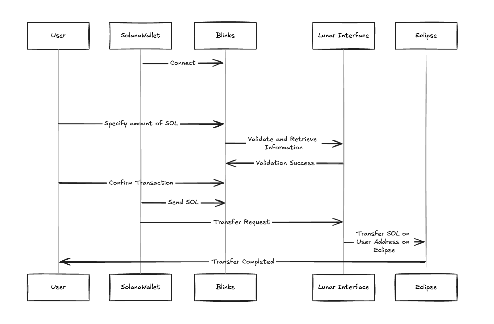

# Lunar: Simplifying Bridging to Eclipse

  

Lunar is an innovative bridge that streamlines the process of transferring SOL tokens from Solana to Eclipse. By leveraging Solana's Blockchain Links (blinks), Lunar provides a seamless and user-friendly experience for newcomers and experienced users alike.

## Why Lunar?

Lunar was created with one primary goal: to make onboarding to Eclipse as simple and intuitive as possible. Here's how Lunar achieves this:

1. **One-Click Bridging**: Transfer your SOL to Eclipse with just a few clicks, eliminating complex multi-step processes.

2. **Familiar Interface**: Utilizes Solana's blink technology, providing a consistent experience for Solana users.

3. **No New Wallets Required**: Use your existing Solana wallet to bridge assets, reducing friction and potential security risks.

4. **Instant Feedback**: Receive immediate confirmation of your bridge transaction, enhancing user confidence.

5. **Transparent Process**: Clear, step-by-step guidance throughout the bridging process, making it accessible even to blockchain newcomers.

## Features

- Seamless SOL transfer from Solana to Eclipse
- User-friendly blink interface
- Secure transaction handling with cross-chain verification
- Real-time transaction status updates

  

## The Future of Lunar

We're committed to continually improving Lunar to make the bridge between Solana and Eclipse even more seamless. Stay tuned for upcoming features like:

- Multi-token support
- Advanced transaction tracking
- Integration with popular Solana dApps

Join us in making the transition to Eclipse as smooth as possible for everyone!

---

Lunar: Your gateway to Eclipse - Simple, Secure, Seamless.
